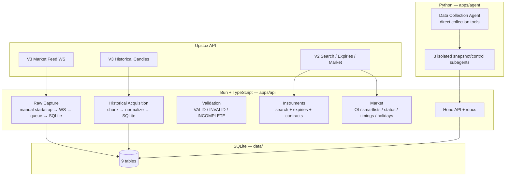
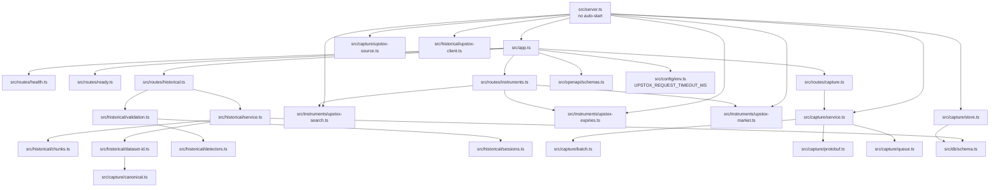

# Tradex Project Graph

Generated from the actual repository (imports, routes, tests).
Mermaid diagrams render on GitHub / VS Code.

> Scope (2026-09-29): Bun + TypeScript API (`apps/api`, 42 src files) and
> Python Data Collection Agent (`apps/agent`, 9 py files).

## 1. System map

## 2. Module dependencies (API)

## 3. HTTP endpoints (27)

| Tag | Method + Path |
|---|---|
| system | `GET /health`, `GET /ready` |
| capture | `GET /capture/status`, `GET /capture/stats`, `GET /capture/subscriptions`, `POST /capture/subscriptions`, `POST /capture/start`, `POST /capture/stop` |
| historical | `POST /historical/datasets`, `GET /historical/datasets/{datasetId}`, `POST /historical/datasets/{datasetId}/validation`, `GET /historical/datasets/{datasetId}/validation` |
| instruments | `GET /instruments/search`, `GET /instruments/expiries`, `GET /instruments/option-contracts`, `GET /instruments/expired-option-contracts`, `GET /instruments/expired-future-contracts`, `GET /instruments/expired-candles` |
| market | `GET /market/smartlists/options`, `GET /market/smartlists/futures`, `GET /market/oi`, `GET /market/change-oi`, `GET /market/max-pain`, `GET /market/pcr`, `GET /market/status`, `GET /market/timings`, `GET /market/holidays` |
| — | `GET /openapi.json`, `/docs` (Scalar UI) |

Capture never auto-starts: boot is always `STOPPED`; `POST /capture/start`
connects (idempotent), `POST /capture/stop` flushes and disconnects.

## 4. Agent (apps/agent — 23 tools, 3 subagents)

Main agent calls collection tools directly (one call per operation):
`search_instruments`, `fetch_option_contracts`, `fetch_expiries`,
`fetch_expired_option_contracts`, `fetch_expired_future_contracts`,
`acquire_dataset` (fetch + validate merged), `fetch_historical`,
`validate_dataset` (standalone).

| Subagent | Tools |
|---|---|
| `market_information` | `get_options_smartlist`, `get_futures_smartlist`, `get_oi`, `get_change_oi`, `get_max_pain`, `get_pcr` |
| `market_status` | `get_exchange_status`, `get_market_timings`, `get_market_holidays` |
| `capture_controller` | `get_capture_status`, `get_capture_stats`, `get_subscriptions`, `update_subscriptions`, `start_capture`, `stop_capture` |

Main agent holds the collection tools and routes only snapshot context
through delegation. Filesystem is hard-denied at build
(`FILESYSTEM_DENY_ALL`, inherited by subagents). Non-secret config
resolves through `settings.py`.

## 5. Database tables (data/research.db + data/capture/)

| Table | Writer |
|---|---|
| `database_probe` | foundation |
| `raw_batches`, `raw_market_messages`, `capture_errors` | capture/store.ts → `data/capture/YYYY-MM-DD/raw.sqlite` |
| `historical_datasets`, `historical_chunks`, `historical_raw_responses`, `historical_candles` | historical/service.ts |
| `validation_reports` | historical/validation.ts |

## 6. Tests — 133 API (bun + vitest, 20 files) + 22 agent (pytest)

API: capture (protobuf incl. market-info map regression, batch, queue,
store, service, subscriptions, manual start/stop lifecycle) · historical
(chunks/client/dataset/service/endpoints/validation) · instruments +
market (search/expiries/contracts/status/timings/holidays, token hygiene,
auth mapping) · app/config (timeout precedence)/database. `tsc` clean.

Agent: prompt contracts (scope refusal, tool-existence, arg vocab),
recording-model run (≤4 LLM calls, no fs/task calls), subagent toolsets +
fs-hiding (3), tool URL-forwarding + error-as-result, caps, filesystem
deny, explicit-model + subagent-model override, settings
defaults/override. `ruff` + `mypy` clean.

## 7. Key contracts

- `instrumentKey` is the canonical instrument identity (no resolver).
- `dataset_id` = SHA-256(canonical request) — single identity scheme.
- Instrument/market discovery is read-only; nothing is stored.
- Expired keys carry a date suffix (`NSE_FO|58422|03-10-2024`).
- Upstox minute intervals are open-ended (`\d+minute` verified live).
- Search `expiry` keywords are unreliable upstream (`current_week`
  returned zero rows live 2026-09-29 while explicit dates worked) —
  prefer `YYYY-MM-DD`.
