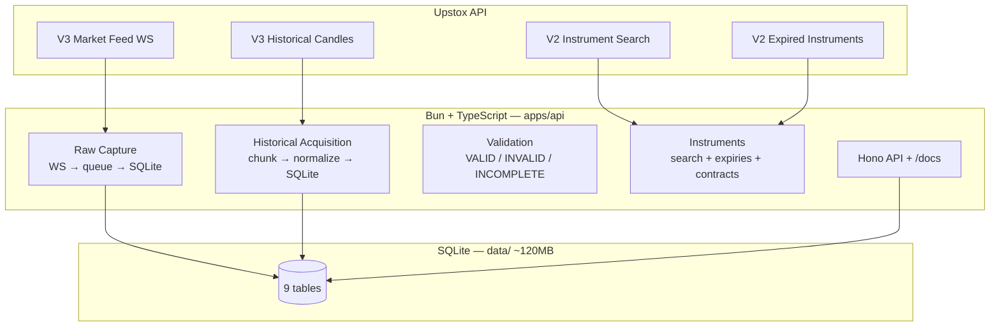
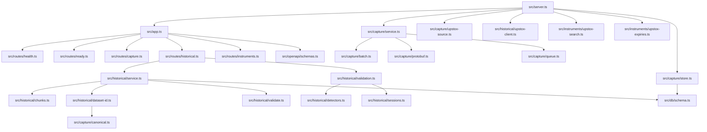

# Tradex Project Graph

Generated from the actual repository (imports, routes, migrations, tests).
Mermaid diagrams render on GitHub / VS Code.

> Scope (2026-09-27): TypeScript backend only (`apps/api`, 40 src files).
> Python `apps/agents` and `apps/agent-ui` were removed by the owner.

## 1. System map

## 2. Module dependencies

## 3. HTTP endpoints (14)

| Method | Path |
|---|---|
| GET | `/health` |
| GET | `/ready` |
| GET | `/capture/status` |
| GET | `/capture/stats` |
| GET | `/capture/subscriptions` |
| POST | `/capture/subscriptions` |
| POST | `/historical/datasets` |
| GET | `/historical/datasets/{datasetId}` |
| POST | `/historical/datasets/{datasetId}/validation` |
| GET | `/historical/datasets/{datasetId}/validation` |
| GET | `/instruments/search` |
| GET | `/instruments/expiries` |
| GET | `/instruments/option-contracts` |
| GET | `/instruments/expired-option-contracts` |
| GET | `/instruments/expired-future-contracts` |
| GET | `/instruments/expired-candles` |
| GET | `/openapi.json`, `/docs` |

## 4. Database tables (data/research.db + data/capture/)

| Table | Writer |
|---|---|
| `database_probe` | foundation |
| `raw_batches`, `raw_market_messages`, `capture_errors` | capture/store.ts → `data/capture/YYYY-MM-DD/raw.sqlite` |
| `historical_datasets`, `historical_chunks`, `historical_raw_responses`, `historical_candles` | historical/service.ts |
| `validation_reports` | historical/validation.ts |

## 5. Tests — 104 pass, 0 fail (19 files: `bun test` + vitest + `tsc`)

Capture (protobuf/batch/queue/store/service/subscriptions) · historical
(chunks/client/dataset/service/endpoints/validation) · instruments
(search/expiries/contracts) · app/config/database.

## 6. Key contracts

- `instrumentKey` is the canonical instrument identity (no resolver).
- `dataset_id` = SHA-256(canonical request) — single identity scheme.
- Instrument discovery is read-only; nothing is stored.
- Expired keys carry a date suffix (`NSE_FO|58422|03-10-2024`).
- Upstox minute intervals are open-ended (`\d+minute` verified live).
